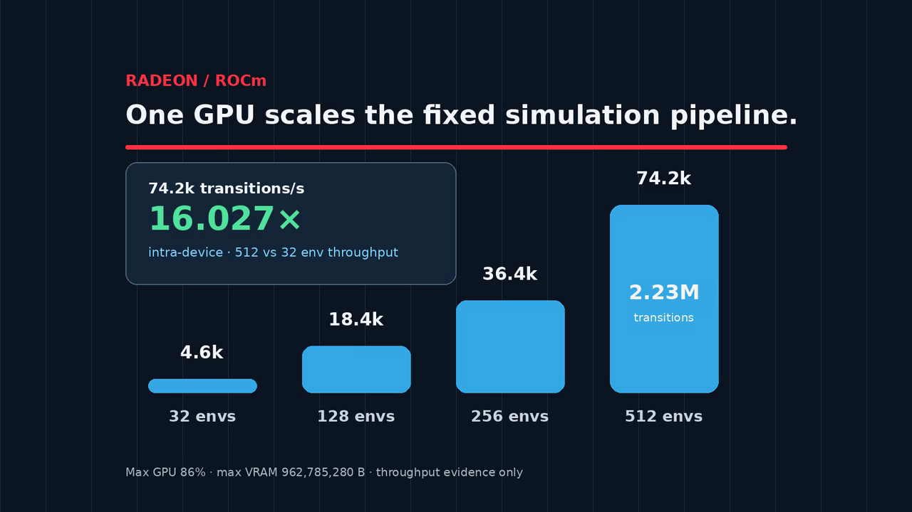

# FlightGuard — Sampled Flight-Controller Qualification on AMD Radeon

**Team:** 做实验摸鱼呢

**Participant:** Haokai Ding (solo)

> **AMD Track 3 · simulation-only.** FlightGuard runs matched quadrotor missions in Genesis through PyTorch ROCm on one AMD Radeon GPU. It helps robotics teams find controller failures, compare a targeted change, and review the result before hardware testing.

## 60-second judge path

From the competition repository root:

```bash
cd submissions/track3-flightguard
python3 scripts/judge_smoke.py
```

Expected headline:

```text
FlightGuard judge smoke: PASS
nominal envelope | 384 paired contexts | 1152 method episodes | every method 384/384
collector | 186/192 survivors | all tracked fields finite | applied saturation max 0.0
challenge arena | primary 194/384 -> 371/384 (+46.1 pp) | retention 121/192 -> 192/192 | 0 regressions
Radeon | 2,227,200 transitions | 16.027013647337444x scaling
```

This CPU-only check reads the submitted metrics, Challenge Arena pairs, figures, and videos. It does not rerun Genesis or require network access.

## Watch first

[](submission/flightguard-final-narrative-v6.mp4)

The [one-minute judge video](submission/flightguard-final-narrative-v6.mp4) is **60.9 seconds, 1280×720, and 60 fps**. It opens with the measured Challenge Arena comparison, shows the 13-gate course, and closes with Radeon scaling and the claim boundary. The 13-gate segment is a visual-only simulation and is excluded from the 384/192 measured results.

For the shortest before/after view, open the [7-second paired Genesis replay](submission/flightguard-challenge-arena-v1.mp4): nominal PD collides at step 167 with 0/3 gates, while `robust_z` completes 3/3 gates at step 479 in the same scene.

## Capability

FlightGuard asks one practical question: **does a controller complete the same mission more reliably when vehicle and environment conditions become difficult?**

The Challenge Arena compares matched pairs. Initial state, gate geometry, mass, thrust, wind, action delay, and random streams are identical within each pair. The only intervention is:

- `kp_z`: 2.5 → 8.0
- `kd_z`: 2.0 → 3.6

| Suite | Matched pairs | Nominal PD | `robust_z` | Added successes | Nominal-only wins |
|---|---:|---:|---:|---:|---:|
| Primary adversarial | 384 | 194/384 (50.5%) | 371/384 (96.6%) | +177 (+46.1 pp) | 0 |
| Retention heldout | 192 | 121/192 (63.0%) | 192/192 (100.0%) | +71 (+37.0 pp) | 0 |

The primary result spans three preregistered seeds; their added-success counts are +57, +58, and +62. Primary failures fall from 190 to 13, a 93.16% reduction. All paired traces are finite and maximum applied-action saturation is 0.0 for both arms.

A bit-exact no-op confirms that the comparison path does not change an unchanged controller. A zero-action kill-magnitude control reaches 0/8 successes and produces 10.506417 m maximum paired-active divergence, confirming that the evaluation responds to the controller intervention.


## Radeon execution

Genesis runs the batched simulation through PyTorch HIP/ROCm. Every source mission and collector run reports exactly one visible `AMD Radeon Graphics`; GPU work is serialized.

A fixed one-Radeon workload measures **2,227,200 transitions**:

| Parallel environments | Mean transitions/s |
|---:|---:|
| 32 | 4,632.582556654058 |
| 128 | 18,354.411592309174 |
| 256 | 36,383.01129648785 |
| 512 | 74,246.46385791198 |

The 32→512 run reaches **16.027013647337444× intra-device speedup** with **1.0016883529585903 parallel efficiency**. Maximum observed VRAM is **962,785,280 bytes**.

## Application value

FlightGuard turns controller qualification into a reviewable pre-hardware workflow:

1. sample reproducible mass, thrust, wind, delay, and gate-course conditions;
2. run paired Genesis missions on Radeon;
3. check completion, strikes, terminal outcomes, finiteness, and action saturation;
4. compare a focused controller change across multiple seeds;
5. give reviewers the raw metrics, visual replay, and one-command smoke check.

The intended users are embodied-AI researchers and flight-control developers deciding which controller changes deserve scarce hardware-test time.

## Additional qualification evidence

The heldout three-gate suite uses seeds 303, 304, and 305:

- **384 paired course contexts** and **1,152 method episodes**;
- each registered replica completes **384/384 missions** and **1,152/1,152 gate passes**;
- zero strikes, mission failures, terminal failures, or unfinished episodes;
- all tracked mission tensors finite;
- observed mass scale 0.80046–1.19933, thrust scale 0.80609–1.19861, wind norm 0–0.59828 m/s², and action delay 0–6 steps.

The three registered replicas tie exactly, so this result supports the shared `robust_z` controller and sampled evaluator rather than a learned-method comparison.

Across 192 training-distribution collector environments, **186/192 survive**, every tracked field is finite, and maximum per-environment applied-action saturation is **0.0**.

## Track 3 reproducibility instructions

Run every command below from `submissions/track3-flightguard`. The submitted campaign used Linux, Python 3.12, Genesis 1.2.3, a ROCm-enabled PyTorch build, and one visible AMD Radeon GPU. Install the matching ROCm/PyTorch stack first; the project install must keep that build in place.

### Prerequisites and install

```bash
cd submissions/track3-flightguard

# Activate a Python 3.10–3.12 environment that already has ROCm PyTorch.
python -m pip install -e '.[sim]'
# Optional; judge_smoke.py uses this for video metadata checks.
python -m pip install opencv-python-headless
```

The event-cloud environment used for the submitted evidence is:

```bash
export FG_PYTHON=/opt/venv/bin/python3.12
export PYTHONPATH=/workspace/genesis-v1.2.3-src-b:$PWD:$PWD/src
export PYGLET_HEADLESS=1
export HIP_VISIBLE_DEVICES=0
```

For a normal installed Genesis package, set `FG_PYTHON` to that environment's Python and use `PYTHONPATH="$PWD:$PWD/src"`. Keep `HIP_VISIBLE_DEVICES=0`: the campaign is single-Radeon and the jobs below must run serially.

### 1. CPU-only submitted-evidence check

```bash
python3 scripts/judge_smoke.py
```

This requires no GPU, simulator run, or network. Expected output begins with `FlightGuard judge smoke: PASS` and the four headline rows shown in the 60-second judge path above.

### 2. Verify the Genesis AMD backend

```bash
"$FG_PYTHON" scripts/smoke_genesis_amd.py \
  --num-envs 8 --steps 32 --seed 0 | tee /tmp/flightguard-genesis-smoke.json
```

The JSON should report the AMD GPU backend/device, `num_envs: 8`, `steps: 32`, `observation_finite: true`, and `isolated_reset: true`. This is a small functional smoke run, not a benchmark.

### 3. Reconstruct the submitted runner without using the GPU

```bash
"$FG_PYTHON" scripts/reconstruct_challenge_arena_amd.py \
  --validate-only --work-root /workspace
```

This creates and removes a temporary worktree under `/workspace`; it does not modify submitted evidence.

### 4. Rerun the complete Challenge Arena on one Radeon

The campaign contains eight fresh, serial jobs: no-op, kill-magnitude, three primary adversarial seeds, and three retention-heldout seeds.

```bash
REPRO_DIR="/workspace/flightguard-challenge-arena-repro-$(date -u +%Y%m%dT%H%M%SZ)"
mkdir "$REPRO_DIR"

run_arena () {
  "$FG_PYTHON" scripts/reconstruct_challenge_arena_amd.py \
    --work-root /workspace --output "$1" --mode "$2" \
    --domain-profile "$3" --seed "$4" --pairs "$5" --steps "$6"
}

run_arena "$REPRO_DIR/noop-seed264617362-recovery-v2.json" \
  noop adversarial 264617362 8 800
run_arena "$REPRO_DIR/kill-seed881940697.json" \
  kill adversarial 881940697 8 800

for seed in 831900462 200501215 144856705; do
  run_arena "$REPRO_DIR/primary-adversarial-seed$seed.json" \
    compare adversarial "$seed" 128 1500
done

for seed in 831900462 200501215 144856705; do
  run_arena "$REPRO_DIR/retention-heldout-seed$seed.json" \
    compare heldout "$seed" 64 1500
done

"$FG_PYTHON" scripts/summarize_challenge_arena.py \
  --input-dir "$REPRO_DIR" \
  --output "$REPRO_DIR/challenge-arena-summary.json"
```

Expected outputs are eight per-job JSON records plus `challenge-arena-summary.json` under the fresh `REPRO_DIR`. A matching summary reports `status: PASS`, primary `194/384 → 371/384`, retention `121/192 → 192/192`, and zero nominal-only regressions. Machine-dependent elapsed time and throughput can differ.

The submitted per-job GPU loops took 4.76–5.77 seconds each (about 42 seconds in total). Allow additional time for first-use Genesis/JIT startup and the temporary reconstruction performed by each command; installation time is separate. Use one ROCm-compatible Radeon with roughly 1 GB or more free VRAM—the submitted fixed scaling workload peaked below 1 GB—and do not run these jobs concurrently.

### 5. Open the reviewer page and videos

```bash
python3 -m http.server 8000 --directory demo/faultfork
```

Open `http://127.0.0.1:8000`. The main assets can also be opened directly:

- [`submission/flightguard-final-narrative-v6.mp4`](submission/flightguard-final-narrative-v6.mp4): one-minute judge tour
- [`submission/flightguard-challenge-arena-v1.mp4`](submission/flightguard-challenge-arena-v1.mp4): 7-second paired measured replay
- [`submission/flightguard-genesis-a2rl-course-visual-v3-cinematic.mp4`](submission/flightguard-genesis-a2rl-course-visual-v3-cinematic.mp4): 13-gate visual-only Genesis course

## Upstream contribution

[Genesis PR #3159](https://github.com/Genesis-Embodied-AI/genesis-world/pull/3159) updates the AMD Docker path from PyTorch 2.6 to AMD's PyTorch 2.8 image and adds a static regression test. It is an open software contribution and is reported separately from FlightGuard's controller-capability results.

## Key submission files

- [`docs/technical-report.md`](docs/technical-report.md): method, results, and limits
- [`submission/flightguard-final-narrative-v6.mp4`](submission/flightguard-final-narrative-v6.mp4): one-minute judge video
- [`submission/flightguard-challenge-arena-v1.mp4`](submission/flightguard-challenge-arena-v1.mp4): 7-second paired replay
- [`submission/evidence/challenge-arena/`](submission/evidence/challenge-arena/): raw pairs and aggregate metrics
- [`submission/evidence/raw-metrics/`](submission/evidence/raw-metrics/): nominal mission and collector metrics
- [`submission/evidence/radeon-formal-scaling.json`](submission/evidence/radeon-formal-scaling.json): one-Radeon scaling measurements
- [`demo/faultfork/`](demo/faultfork/): static reviewer page

## Claim boundary

FlightGuard is a simulation-only controller-qualification prototype evaluated over sampled contexts. It does not establish physical-flight safety, certification, sim-to-real transfer, a continuous flight envelope, population generalization, learned-method superiority, or SOTA superiority.
