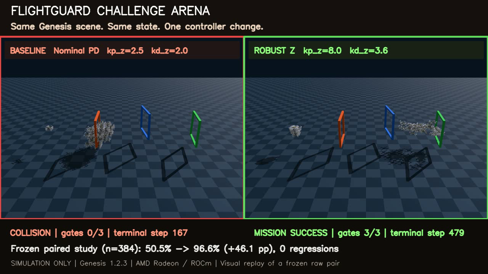
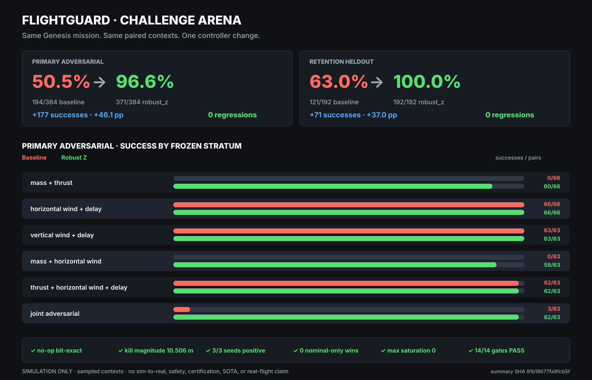

# FlightGuard — Radeon-Native Sampled Nominal Flight Envelope Verifier

> **AMD Track 3 · simulation-only.** FlightGuard runs a reproducible three-gate quadrotor mission suite in Genesis on one AMD Radeon GPU through PyTorch ROCm. It verifies controller behavior over sampled heldout mass, thrust, wind, and action-delay contexts, then exports hash-bound evidence that a judge can check without rerunning the simulator.

## 60-second judge path

From the competition repository root:

```bash
cd submissions/track3-flightguard
python3 scripts/judge_smoke.py
```

Expected headline:

```text
FlightGuard judge smoke: PASS
nominal envelope | 384 paired contexts | 1152 method episodes | every method 384/384
collector | 186/192 survivors | all tracked fields finite | applied saturation max 0.0
challenge arena | primary 194/384 -> 371/384 (+46.1 pp) | retention 121/192 -> 192/192 | 0 regressions
Radeon | 2,227,200 transitions | 16.027013647337444x scaling
```

The command validates the six nominal-envelope raw metric files, the Challenge Arena raw pairs and summary, mission and collector totals, one-Radeon execution, throughput evidence, retained falsification lineage, and reviewer video assets. It is evidence-only: no GPU, simulator, training, or network access.

## Start here — 7-second Challenge Arena

[](submission/flightguard-challenge-arena-v1.mp4)

[`submission/flightguard-challenge-arena-v1.mp4`](submission/flightguard-challenge-arena-v1.mp4) is a 7-second, 1280×720, 20 fps side-by-side replay of a frozen raw pair in the same Genesis scene. The nominal controller collides at step 167 with 0/3 gates; `robust_z` completes 3/3 gates at step 479 without a strike. The clip is visual evidence bound to the raw pair and summary; the aggregate metrics below come from all frozen pairs, not from the selected clip.

Across three preregistered seeds in the primary adversarial suite, `robust_z` improves mission success from **194/384 = 50.5%** to **371/384 = 96.6%**: **+177 successes, +46.1 percentage points, 93.16% failure reduction, and zero nominal-only wins**. In a separate retention-heldout suite it improves **121/192 = 63.0%** to **192/192 = 100.0%**, again with zero nominal-only wins. All 14 frozen gates pass, including bit-exact no-op, kill magnitude, three positive seeds, finite paired traces, and maximum applied-action saturation 0.0.

Only the vertical controller gains change (`kp_z`: 2.5→8.0, `kd_z`: 2.0→3.6); paired initial state, environment parameters, gates, and random streams remain identical. This is a sampled simulation comparison against the project's nominal PD baseline, not a SOTA, safety, sim-to-real, or real-flight claim.



## Full reviewer video

`submission/flightguard-nominal-envelope-demo-v2.mp4` is the positive-first 210-second reviewer artifact: 1280×720, 10 fps, 2,100 frames, reported codec `FMP4`, no audio, 17,428,715 bytes, SHA-256 `a5f13ea90ed64468299e925721607c2a2e896efc33fc99213f50cb0fa50799fd`.

Its 00:30–01:20 segment embeds the existing `submission/genesis-nominal-visual-replay.mp4`: fixed seed 5001, truth-controller, nominal simulation visual, 500 frames, SHA-256 `adc0ea528b611e55dca006d220c30ef935f32448f6b935b7b6c1a33cd9d9fbce`. The clip is metric-ineligible and is not one of the 384 heldout evidence contexts. Numeric cards are independently derived from the six submitted raw metric JSON files and the aggregate.

The renderer is `scripts/render_submission_video.py`, 26,993 bytes, SHA-256 `a0a17d91e15c92f8541da594c7c2ca04b97ce7c5326f61b08436798caace35cd`.

## What the project delivers

FlightGuard answers a practical Physical-AI question:

**Does a simulated flight controller complete a defined mission across a reproducible sample of off-nominal vehicle and environment conditions on Radeon?**

The workflow is:

1. Generate deterministic training-distribution and heldout domain samples.
2. Run a three-gate flight mission with the `robust_z` controller in Genesis.
3. Execute each source run with exactly one visible AMD Radeon GPU.
4. Check mission completion, strikes, terminal failures, unfinished episodes, tensor finiteness, and collector action saturation.
5. Aggregate results from seeds 303, 304, and 305 into a hash-bound submission artifact.
6. Keep failed research mechanisms as transparent limitations instead of using them as the project headline.

```text
sampled mass / thrust / wind / delay contexts
                      │
                      ▼
       Genesis quadrotor + robust_z controller
                      │
                      ▼
              one Radeon via ROCm
                      │
          ┌───────────┴───────────┐
          ▼                       ▼
  three-gate mission       training collector
          │                       │
          └───────────┬───────────┘
                      ▼
     finite / terminal / saturation checks
                      │
                      ▼
       frozen JSON + figures + reviewer video
```

## Verified result

### Challenge Arena — paired controller capability

The frozen comparison uses the same initial state, gate geometry, vehicle/environment parameters, and random stream for each nominal/`robust_z` pair. The controller setting was frozen before the three formal seeds were run.

| Suite | Pairs | Nominal PD | `robust_z` | Added successes | Nominal-only wins |
|---|---:|---:|---:|---:|---:|
| Primary adversarial | 384 | 194/384 (50.5%) | 371/384 (96.6%) | +177 (+46.1 pp) | 0 |
| Retention heldout | 192 | 121/192 (63.0%) | 192/192 (100.0%) | +71 (+37.0 pp) | 0 |

Primary failures fall from 190 to 13, a 93.16% reduction. Every formal seed is positive (+57, +58, +62 successes), strikes fall from 178 to 13, terminal failures fall from 190 to 13, and maximum applied-action saturation is 0.0 for both arms. The no-op is bit-exact; a zero-action kill control produces 0/8 successes and 10.506417 m paired-active divergence, confirming that the evaluation responds to a real controller intervention.

### Heldout three-gate mission

Across seeds 303, 304, and 305:

- **384 paired heldout course contexts**
- **1,152 method episodes** across three registered replicas: `constant_velocity`, `hold_last`, and `learned`
- **384/384 mission completions for each replica**
- **1,152/1,152 gate passes for each replica**
- **0 strikes, 0 mission failures, 0 terminal failures, and 0 unfinished episodes**
- all tracked mission tensors finite
- every source run reports exactly one visible `AMD Radeon Graphics`

The replicas tie exactly. This result supports the shared `robust_z` controller and domain-randomized evaluator; it does **not** support learned-method superiority.

The sampled heldout contexts span the observed ranges:

| Parameter | Observed sampled range |
|---|---:|
| Mass scale | 0.80046–1.19933 |
| Thrust scale | 0.80609–1.19861 |
| Wind acceleration norm | 0–0.59828 m/s² |
| Action delay | 0–6 steps |

These are sampled contexts, not a continuous hyper-rectangle guarantee or a formal flight-envelope certificate.

The configured one-step dropout begins at step 999. Reported mean terminal steps are 464.7421875, 466.46875, and 466.3046875, more than 532 steps earlier. The source metrics do not expose each episode's maximum terminal step, so FlightGuard makes no dropout-recovery claim and does not claim every episode ended before dropout.

### Training-distribution collector

Across 192 environments from seeds 303–305:

- **186/192 survivors = 96.875%**
- all position, velocity, quaternion, angular velocity, issued-action, and applied-action tensors finite
- maximum per-environment applied-action saturation fraction **0.0**
- every source run reports exactly one visible Radeon GPU

Saturation is available for the collector only. The heldout mission metrics do not contain a saturation field, so no mission-saturation claim is made.

### Radeon scaling

The fixed r5 deployed simulation pipeline measured **2,227,200 transitions** on one Radeon:

| Environments | Mean transitions/s |
|---:|---:|
| 32 | 4,632.582556654058 |
| 128 | 18,354.411592309174 |
| 256 | 36,383.01129648785 |
| 512 | 74,246.46385791198 |

The 32→512 result is **16.027013647337444× speedup** with **1.0016883529585903 parallel efficiency**. Maximum observed VRAM was **962,785,280 bytes**. This is a fixed-workload intra-device scaling result, not a cross-device benchmark.

## AMD Radeon / ROCm use

- Simulator: Genesis
- Compute path: PyTorch HIP/ROCm
- Reported device: `AMD Radeon Graphics`
- Resource discipline: exactly one visible Radeon per source run, GPU work serialized
- Radeon workload: batched domain-randomized simulation, mission evaluation, capture/replay utilities, and fixed-pipeline scaling
- Evidence: source metrics preserve device name, visible GPU count, seeds, integrity results, and performance measurements

FlightGuard's Radeon value comes from two independently frozen one-Radeon campaigns: the mission/collector runs execute the Physical-AI simulation, while the separate fixed-workload run measures scaling from 32 to 512 parallel environments.

## Reproduce and inspect

### Dependencies

- Linux
- Python 3.12
- AMD Radeon GPU with a compatible ROCm/PyTorch stack
- Genesis dependencies listed by the project environment
- OpenCV only for video metadata checks in `judge_smoke.py`

### Evidence-only verification

```bash
cd submissions/track3-flightguard
python3 scripts/judge_smoke.py
```

### Recompute Challenge Arena from submitted raw bytes

```bash
arena_tmp=$(mktemp -d)
tar -xzf submission/evidence/challenge-arena/challenge-arena-raw-json-v1.tar.gz -C "$arena_tmp"
python3 scripts/summarize_challenge_arena.py \
  --input-dir "$arena_tmp" \
  --output "$arena_tmp/recomputed-summary.json"
```

The archive stores the eight original JSON byte streams. `judge_smoke.py` verifies the archive SHA, exact member inventory, every decompressed member SHA, all aggregates, and all 14 gates without extracting to disk. A recomputed summary changes only machine-specific `path`/`*_path` prefixes; after basename normalization the submitted and recomputed JSON documents are exact.

### Rebuild figures from frozen evidence

```bash
python3 scripts/build_award_figures.py \
  --v4 submission/evidence/v4-summary.json \
  --v5 submission/evidence/v5-summary.json \
  --v6 submission/evidence/v6-checkpoint-30.json \
  --scaling submission/evidence/radeon-formal-scaling.json \
  --output-dir /tmp/flightguard-figures
```

### Static evidence explorer

```bash
python3 -m http.server 8000 --directory demo/faultfork
```

Open `http://127.0.0.1:8000`. The interface is schematic and cannot change the frozen results.

## Frozen evidence

| Artifact | SHA-256 | Meaning |
|---|---|---|
| `submission/evidence/challenge-arena/challenge-arena-summary.json` | `91b18677fa9fcb5f05acead2aa3fb4324188b44173ea85fda75c67e2dcb129ee` | frozen paired Challenge Arena aggregate; 14/14 gates PASS |
| `submission/evidence/challenge-arena/challenge-arena-raw-json-v1.tar.gz` | `21647f791444aed708da5e056f17af98258fbc7605bb46acb4a148c0f6a6811b` | deterministic archive of the eight original raw JSON byte streams; 94,002 bytes |
| `submission/evidence/verified-flight-envelope-aggregate.json` | `c7ca6e460e967c3070736d8120bd918a3c489f1e7d62a3ae933ab631af827f58` | positive aggregate of existing collector and heldout mission metrics |
| `submission/evidence/raw-metrics/training-collector/seed303-metrics.json` | `aaa5e1e4654aec24b907527eb5334338a50f328c679eace8208b87f650e36959` | raw collector seed 303 |
| `submission/evidence/raw-metrics/training-collector/seed304-metrics.json` | `61b70eead81696608a75436db23f59be9f01a25f65d09af9bc81a6d489010b54` | raw collector seed 304 |
| `submission/evidence/raw-metrics/training-collector/seed305-metrics.json` | `24cadca684b1de7f069f4ffb3767502396c1f38031f35e606157fc7874395955` | raw collector seed 305 |
| `submission/evidence/raw-metrics/heldout-three-gate-mission/seed303-metrics.json` | `7d30a032a032b3d757a77afbe8ed60aa97c61e54f557ef2ba242251b14f14238` | raw heldout mission seed 303 |
| `submission/evidence/raw-metrics/heldout-three-gate-mission/seed304-metrics.json` | `c3408cbb720df48690783888e6335b6350c265ad4af8526d72486250aa2204a8` | raw heldout mission seed 304 |
| `submission/evidence/raw-metrics/heldout-three-gate-mission/seed305-metrics.json` | `e546809527d28df7b25fa82ad2d552de170672c871fee6aed132889f38d8d63e` | raw heldout mission seed 305 |
| `submission/evidence/radeon-formal-scaling.json` | `98d9b331907f9968ae65054c6f9d840dc0440eb9209c14e955dc628df736f072` | fixed-workload one-Radeon scaling |
| `submission/evidence/v4-summary.json` | `4ebab98a9b9c3b134548ef646c30aaafbd7d6ddeaa8a0485b667ee8054f80f8b` | retained v4 scientific FAIL |
| `submission/evidence/v5-summary.json` | `d546a620931fc3afb2c074d749e1fe017ba6c4dcdf2d05b570855a913e83b034` | retained v5 award-ineligible scout |
| `submission/evidence/v6-checkpoint-30.json` | `905925dedc62a41a8b4c35ace8b1c5a1bd1d97c9cb4d43a5f513f3827cf0a678` | retained v6 checkpoint-30 rejection |
| `submission/evidence/v6-audit-receipt.json` | `521738135a3dcc28dc42ecd8b4f01fe5abe925b8353a45577d0b8b5de9e3e8c1` | v6 command/output binding |
| `submission/evidence/capture-terminal.json` | `923c24124f9af6d53d82a80c9efd72d8e5ada962a4ceb30adf48e232c2c341be` | completed Radeon capture jobs |
| `submission/evidence/frozen-claim-auditor-benchmark.json` | `ccbf38ef7aa36571c3f2433d5f4e9d54b1dd1de7cc2e8f93f2291ccc816f83f7` | four-case evidence-auditor benchmark |

The nominal-envelope aggregate was generated only from six existing source metric files. The Challenge Arena summary independently binds its no-op, kill, three primary, and three retention raw JSON SHA-256 values plus the frozen config and runner. The deterministic archive preserves those eight original JSON byte streams while avoiding a 34,000-line review diff.

## Research lineage and honest stop decisions

The positive submission is the nominal verifier above. Three explored estimator mechanisms remain useful negative evidence:

- **v4 scientific FAIL:** Patch 11/36, ActionOnly 0/36, RawStrapdown 33/36, CalibratedStrapdown 32/36; failure reduction versus ActionOnly 30.56%, below the preregistered 50% gate.
- **v5 award-ineligible:** Patch and CalibratedStrapdown both reached 10/12 fault and 12/12 nominal successes; 19 post-onset operational fields were raw-bit exact, so incremental capability was 0.
- **v6 rejected at checkpoint 30:** 0/12 lanes admitted and 12/12 returned exact-Cal fallback; checkpoints 31 and 32 were not audited after the stop rule.

These results demonstrate that the evaluation pipeline can reject an attractive mechanism, but they are not presented as FlightGuard's winning capability.

## Deliverables

- reproducible source code for Genesis/Radeon simulation and evaluation
- paired Challenge Arena with frozen no-op, kill, three-seed primary, and retention evidence
- 7-second side-by-side baseline-collision versus robust-success Genesis replay
- hash-bound nominal mission and collector aggregate
- one-Radeon scaling evidence
- deterministic figures and machine-readable summaries
- 3.5-minute reviewer video and script
- technical report
- static evidence explorer
- retained failed-mechanism lineage for scientific transparency

## Claim boundary

FlightGuard is:

- simulation-only
- a verifier over sampled contexts
- a one-Radeon ROCm/Genesis workflow
- a reproducible application prototype for experiment triage and controller qualification

FlightGuard does not claim:

- physical-flight validation
- sim-to-real transfer
- safety, certification, or real-flight repair
- a continuous or formally certified flight envelope
- mission saturation, because that field is absent from heldout mission metrics
- dropout recovery
- learned-method superiority
- population generalization
- SOTA superiority; Challenge Arena compares two frozen controllers within this project

## Repository map

- `src/flightguard/`: controller, observer, and IMU components
- `scripts/`: Genesis/Radeon runs, evaluation, figures, and video rendering
- `tools/`: deterministic input and evidence builders
- `docs/technical-report.md`: Track 3 technical report
- `submission/evidence/`: frozen JSON evidence
- `submission/evidence/challenge-arena/`: no-op, kill, three-seed primary, retention, and aggregate evidence
- `submission/figures/challenge-arena.svg`: paired success comparison rebuilt from the frozen summary
- `submission/figures/challenge-arena-terminal.png`: exact terminal frame from the paired replay
- `submission/flightguard-challenge-arena-v1.mp4`: 7-second paired Genesis capability demo
- `submission/figures/`: deterministic evidence views
- `submission/video-script.md`: 210-second English narration and screen plan
- `submission/flightguard-nominal-envelope-demo-v2.mp4`: primary positive-first 210-second reviewer video
- `submission/genesis-nominal-visual-replay.mp4`: fixed-seed 5001 truth-controller nominal visual, metric-ineligible
- `submission/evidence/raw-metrics/`: six byte-exact source metric files
- `demo/faultfork/`: static evidence explorer
